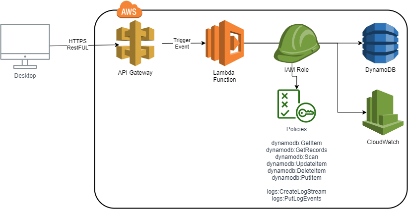
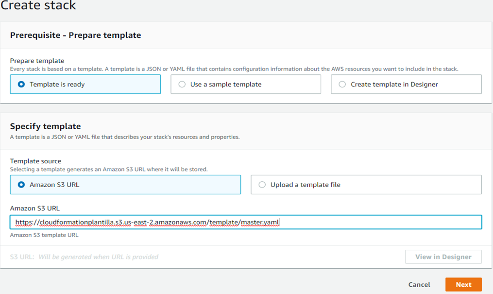
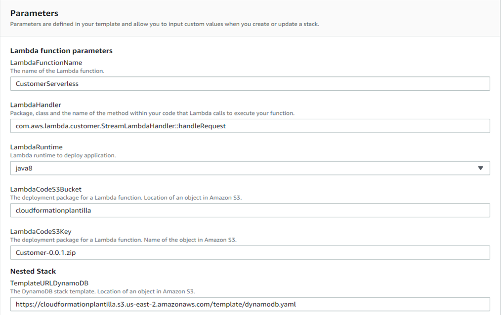
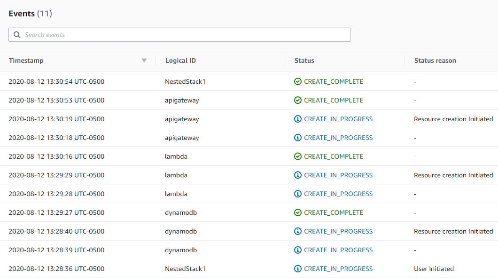
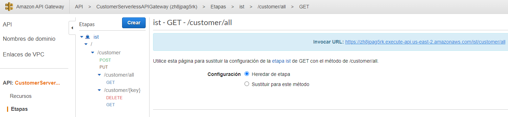
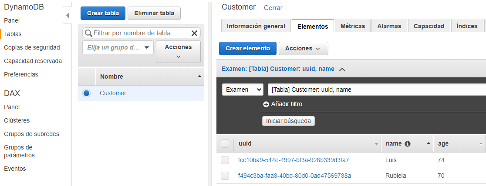

# Scalable Auth System

[](https://aws.amazon.com/)
[](https://spring.io/projects/spring-boot)
[](https://openjdk.java.net/)
[](https://aws.amazon.com/dynamodb/)
[](https://aws.amazon.com/cloudformation/)
[](LICENSE)

A serverless user-management application built with **Spring Boot**, **AWS Lambda**, **DynamoDB**, **API Gateway**, and **CloudFormation**.

This project demonstrates how a Java Spring Boot backend can be adapted for AWS Lambda, exposed through API Gateway, backed by DynamoDB, and deployed using infrastructure-as-code templates.



## Project Goal

The goal of this project is to show a cloud-native backend architecture using managed AWS services instead of a traditional server-based deployment.

It focuses on:

* Serverless backend design
* REST API development
* DynamoDB-backed persistence
* AWS Lambda deployment
* API Gateway routing
* CloudFormation-based infrastructure setup
* Build, test, and deployment documentation

## Architecture Overview

This serverless user-management system uses AWS Lambda, API Gateway, DynamoDB, and CloudFormation to provide a cloud-native backend for user data management.

The architecture focuses on managed compute, API routing, DynamoDB persistence, and reproducible infrastructure setup.

### Main Flow

```text
Client / API Consumer
        |
        v
Amazon API Gateway
        |
        v
AWS Lambda
        |
        v
Spring Boot Application
        |
        v
Amazon DynamoDB
```

## Key Features

* **RESTful API:** CRUD operations for user management
* **User Model:** User entity with validation and audit fields
* **Serverless Compute:** Spring Boot application packaged for AWS Lambda
* **API Routing:** API Gateway routes external requests to Lambda
* **DynamoDB Persistence:** User records stored in DynamoDB
* **Soft Delete:** User activation/deactivation instead of hard deletion
* **Department Filtering:** Retrieve users by department
* **Health Monitoring:** Built-in health check endpoint
* **Testing Structure:** Unit and integration tests for controller, service, and application context
* **Infrastructure as Code:** AWS resources defined with CloudFormation templates

## Cloud Engineering Highlights

* Packaged a Spring Boot backend for AWS Lambda execution
* Exposed REST endpoints through Amazon API Gateway
* Used DynamoDB as the persistence layer for user records
* Defined backend infrastructure using CloudFormation templates
* Added health-check and CRUD endpoints for backend validation
* Included API documentation and deployment instructions for reproducible setup
* Used AWS managed services to avoid maintaining traditional application servers

## Technology Stack

| Area           | Technologies                          |
| -------------- | ------------------------------------- |
| Backend        | Spring Boot 2.3.0, Java 8             |
| Compute        | AWS Lambda                            |
| API Management | Amazon API Gateway                    |
| Database       | Amazon DynamoDB                       |
| Infrastructure | AWS CloudFormation with nested stacks |
| Build Tool     | Gradle                                |
| Testing        | JUnit, Spring Boot Test               |
| Monitoring     | Amazon CloudWatch Logs and Metrics    |
| Deployment     | AWS CLI, S3, CloudFormation           |

## Project Structure

```text
Scalable-Auth-System-Spring-Boot-AWS-Lambda-DynamoDB/
├── Customer/
│   ├── src/main/java/com/aws/lambda/user/
│   │   ├── entities/
│   │   │   └── User.java
│   │   ├── controllers/
│   │   │   └── UserController.java
│   │   ├── services/
│   │   │   ├── UserService.java
│   │   │   └── UserServiceImpl.java
│   │   ├── repositories/
│   │   │   ├── UserRepository.java
│   │   │   └── UserRepositoryImpl.java
│   │   ├── configurations/
│   │   │   └── DynamoDBConfig.java
│   │   ├── UserManagementApplication.java
│   │   └── StreamLambdaHandler.java
│   ├── src/test/java/com/aws/lambda/user/
│   │   ├── controllers/
│   │   │   └── UserControllerTest.java
│   │   ├── services/
│   │   │   └── UserServiceTest.java
│   │   └── UserManagementApplicationTests.java
│   ├── src/main/resources/
│   │   └── application.properties
│   ├── src/test/resources/
│   │   └── application-test.properties
│   ├── build.gradle
│   ├── settings.gradle
│   ├── gradlew
│   └── gradlew.bat
├── doc/img/
│   ├── serverless-aws.png
│   ├── dynamodb-mind-map.jpg
│   ├── api-gateway-mind-map.jpg
│   ├── master-mind-map.jpg
│   └── deployment screenshots
├── conf/
│   └── buildspec.yml
├── master.yaml
├── dynamodb.yaml
├── lambda.yaml
├── apigateway.yaml
├── API_DOCUMENTATION.md
├── DEPLOYMENT_GUIDE.md
├── PROJECT_SUMMARY.md
├── LICENSE
└── README.md
```

## Key Components

### Application Layer

Located under `Customer/src/main/java/com/aws/lambda/user/`.

* **`UserManagementApplication.java`**: Main Spring Boot application entry point
* **`StreamLambdaHandler.java`**: AWS Lambda handler for serverless deployment
* **`entities/User.java`**: User entity with validation and DynamoDB mapping
* **`controllers/UserController.java`**: REST API controller for user operations
* **`services/`**: Business logic layer with validation and error handling
* **`repositories/`**: Data access layer with DynamoDB integration
* **`configurations/DynamoDBConfig.java`**: DynamoDB configuration

### Testing Layer

Located under `Customer/src/test/java/com/aws/lambda/user/`.

* **`UserControllerTest.java`**: Unit tests for API endpoints
* **`UserServiceTest.java`**: Unit tests for business logic
* **`UserManagementApplicationTests.java`**: Integration tests for Spring context

### Infrastructure Layer

CloudFormation templates define the AWS resources required for deployment.

* **`master.yaml`**: Orchestrates nested stack deployment
* **`dynamodb.yaml`**: Creates the DynamoDB table
* **`lambda.yaml`**: Deploys the Lambda function and IAM configuration
* **`apigateway.yaml`**: Configures API Gateway and Lambda integration

### Documentation Layer

* **`README.md`**: Main project overview
* **`API_DOCUMENTATION.md`**: API reference
* **`DEPLOYMENT_GUIDE.md`**: Step-by-step AWS deployment guide
* **`PROJECT_SUMMARY.md`**: Technical summary and project notes

## API Endpoints

| Method   | Endpoint                        | Description                  |
| -------- | ------------------------------- | ---------------------------- |
| `POST`   | `/user`                         | Create a new user            |
| `GET`    | `/user/{uuid}`                  | Retrieve user by UUID        |
| `PUT`    | `/user`                         | Update existing user         |
| `DELETE` | `/user/{uuid}`                  | Soft delete user by UUID     |
| `GET`    | `/user/all`                     | Retrieve all users           |
| `GET`    | `/user/department/{department}` | Retrieve users by department |
| `GET`    | `/user/health`                  | Health check endpoint        |

## Deployment Summary

This project uses AWS CloudFormation templates to provision the main backend infrastructure.

| Template          | Purpose                                               |
| ----------------- | ----------------------------------------------------- |
| `master.yaml`     | Coordinates the deployment stack                      |
| `lambda.yaml`     | Defines the Lambda function and related configuration |
| `dynamodb.yaml`   | Defines the DynamoDB table                            |
| `apigateway.yaml` | Defines API Gateway routing and Lambda integration    |

High-level deployment flow:

1. Build the Spring Boot Lambda package.
2. Upload the Lambda artifact and CloudFormation templates to S3.
3. Deploy the master CloudFormation stack.
4. Retrieve the API Gateway URL from stack outputs.
5. Test the health and user-management endpoints.

For full AWS deployment steps, including S3 upload, CloudFormation stack creation, and API Gateway testing, follow:

[DEPLOYMENT_GUIDE.md](./DEPLOYMENT_GUIDE.md)

## Deployment Screenshots

### CloudFormation Stack Creation



Creating the CloudFormation stack with nested templates.

### Stack Parameters Configuration



Configuring stack parameters for deployment.

### Stack Events Monitoring



Monitoring stack creation progress and events.

### API Gateway Deployment



API Gateway service configuration and deployment.

### DynamoDB Table Creation



DynamoDB user table after deployment.

## Testing

Run unit and integration tests from the `Customer` directory:

```bash
cd Customer
./gradlew test
```

Test coverage includes:

* Controller behavior
* Service-layer business logic
* Spring application context loading
* User-management flow validation

## Quick Start

### Prerequisites

* AWS CLI configured
* Java 8 or higher
* Gradle

### Local Build

```bash
git clone https://github.com/arpitJ-dev/Scalable-Auth-System-Spring-Boot-AWS-Lambda-DynamoDB.git
cd Scalable-Auth-System-Spring-Boot-AWS-Lambda-DynamoDB/Customer
./gradlew clean build
```

### Run Tests

```bash
./gradlew test
```

### Build Deployment Package

```bash
./gradlew buildZip
```

### AWS Deployment

For full deployment instructions, use:

[DEPLOYMENT_GUIDE.md](./DEPLOYMENT_GUIDE.md)

## Performance Characteristics

This project is designed around managed AWS services that can scale with incoming request volume based on AWS Lambda, API Gateway, and DynamoDB configuration.

Actual performance depends on workload, Lambda memory settings, cold starts, DynamoDB capacity mode, and API Gateway behavior.

## Security

This project demonstrates basic cloud security practices for a serverless backend:

* IAM-based access control for AWS resources
* API Gateway HTTPS endpoint usage
* DynamoDB-backed persistence
* Lambda execution role configuration
* Soft delete support for user records

## Monitoring

CloudWatch Logs and Metrics are used for observability.

Useful areas to monitor include:

* Lambda invocation count
* Lambda errors
* Lambda duration
* API Gateway request count
* API Gateway latency
* DynamoDB read/write activity

## Documentation

* [API Documentation](./API_DOCUMENTATION.md)
* [Deployment Guide](./DEPLOYMENT_GUIDE.md)
* [Project Summary](./PROJECT_SUMMARY.md)
* DynamoDB table structure: `doc/img/dynamodb-mind-map.jpg`
* API Gateway configuration: `doc/img/api-gateway-mind-map.jpg`
* CloudFormation stack architecture: `doc/img/master-mind-map.jpg`

## Use Cases

This project can be used as a reference for:

* Serverless CRUD APIs
* User-management workflows
* Spring Boot on AWS Lambda
* API Gateway and Lambda integration
* DynamoDB-backed backend services
* CloudFormation-based backend deployment

## Troubleshooting

### Build Failures

```bash
./gradlew clean build
java -version
```

Java 8 or higher is recommended.

### Deployment Issues

* Ensure AWS CLI is configured with the correct account and region.
* Verify the S3 bucket exists and is accessible.
* Check CloudFormation stack events for specific errors.
* Confirm the Lambda deployment package was uploaded successfully.

### API Testing

```bash
curl -v https://your-api-gateway-url.amazonaws.com/user/health
```

Check Lambda logs:

```bash
aws logs tail /aws/lambda/UserManagementSystem --follow
```

### DynamoDB Issues

```bash
aws dynamodb describe-table --table-name User
```

If the table is not found or access is denied:

* Confirm the CloudFormation stack completed successfully.
* Check the Lambda IAM role permissions.
* Verify the AWS region used for deployment.

## Future Work

Planned improvements may include:

* JWT-based authentication and authorization
* Request validation with clearer error responses
* GitHub Actions workflow for automated build and test
* CloudWatch dashboard screenshots for observability
* Terraform or AWS CDK version of the infrastructure
* Load testing results for API Gateway and Lambda latency
* DynamoDB access pattern documentation

## Contributing

This project serves as a reference implementation for a Spring Boot serverless backend on AWS. Feel free to adapt and extend the codebase for your specific requirements.

### Development Guidelines

* Follow Spring Boot best practices
* Keep API documentation updated
* Add or update tests when changing controller or service logic
* Keep deployment instructions aligned with CloudFormation templates

## License

This project is licensed under the MIT License. See the [LICENSE](./LICENSE) file for details.

---

Built using AWS serverless technologies.
